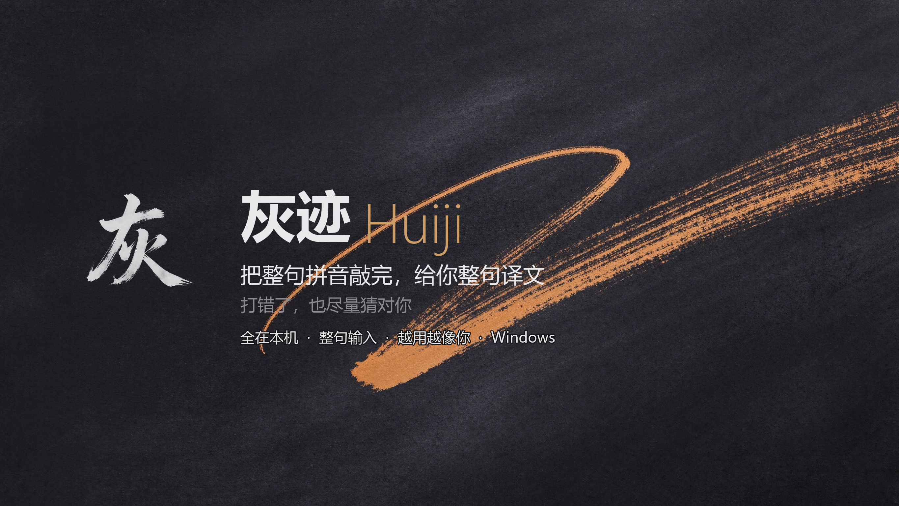
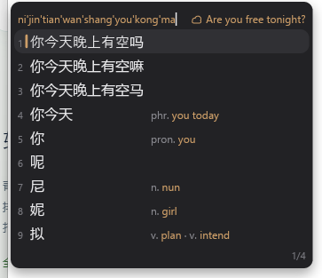

  

  
  
  

灰迹是一款 Windows 拼音输入法，从开源输入法 [青简](https://github.com/qingjian-team/qingjian) 长出来。

它首先得是一款能天天用的输入法，这件事青简已经做好了。灰迹在这个底子上往前走两步：你照平常把一整句拼音连续敲完、不用停下来逐个选词，候选窗顶部就给出整句英文；手滑敲错、或者只打声母缩写，也尽量把你真正想要的词排到前面。

## 为什么叫灰迹

输入法本该在后台。你打字的时候几乎忘了它在，但它一直在——这是「灰」，克制，不抢戏。

你选过哪些词、敲错又改对过什么、嘴上常挂哪句话，这些都会留下痕迹，输入法据此一点点变成「你的」输入法——这是「迹」。

样子也照着这个脾气做。默认是一套深色的「石墨深邃」皮肤：深灰底、圆角、首选词左边一道暖琥珀色的竖条，在一片灰里给一点提示，不花哨。图标是一个透明底的「灰」字。默认深色，不跟随系统。

## 站在青简的肩膀上

青简是一个用 Rust 写的拼音输入法，整句输入，候选由本机小模型重排，本地优先。它最难的地基，灰迹原样继承了下来：

- **整句输入**：连续敲拼音，候选由本机小模型重排，不用一个字一个字凑；
- **多种打法**：全拼、简拼（声母缩写）、双拼、模糊音都支持；
- **拼写纠错、英文模式、emoji**；
- **候选词旁的译词**（青简的招牌）：每个候选词旁边标一条你正在学的语言的译词，带词性，英语或日语一次一种，日语按汉字注假名；没见过几次的生词标橙色，看熟了自动变回灰色；
- **越用越像自己**：选过的词、连着选的词序列（个人 n-gram）、接受过的敲错纠正，都在本机记着，排序据此调整；
- **全在本机**：拼音、词库、整句模型、学习、释义都不联网，不需要账号；
- **可选的云联想，默认关闭**：打开后向你自己填的 AI 服务商要词和整句补全。

青简也有 macOS、Linux 的外壳。灰迹目前只在 Windows 上打磨，那两个平台的代码还在，但没专门调过。

## 灰迹多做了什么

  

**整句翻译：从「词」到「句」，全程离线**

青简把译词标在单个词旁边，只到「词」这一层。灰迹让你把整句拼音敲完，候选窗顶部直接出现整句英文。比如连续敲 `nijintianwanshangyoukongma`，不用逐词选，顶部给出 `Are you free tonight?`（见上图）。

翻译模型和运行时都在本机，不联网、不花钱，敲的内容不出这台电脑。模型是一个约 81 MB 的中英 Marian，已经随安装包一起装好；在 100 句测试集上，译文延迟中位数 50 毫秒。流行语还做了本地术语表，「摸鱼」译成 slack off、「内卷」译成 rat race，比直译更像人话。

**更懂手滑和缩写**

默认开启「中文优先」后，声母缩写（比如敲 `kj` 想要「看见」）的首选命中率从 66.2% 提到 77.5%。只错一个字母的干净串，青简原本就能纠正大部分，灰迹没有在上面硬堆手写规则——规则越加越容易误伤，再往上的空间主要在个性化学习和上下文模型。

**对齐你在微软拼音上的老习惯**

- `-` / `=` 翻页（小键盘 `+`/`-` 在任何翻页档下都能用）；
- `Ctrl + .` 切换中/英文标点；
- `Ctrl + Shift + F` 切换简/繁体；
- `Shift + 空格` 切换全/半角字符；
- V 模式：`v` 后能算算式、查日期（`v2026-10-1`）、查时间（`v12:30`）。

**游戏里不添乱**

检测到前台是独占全屏的游戏，灰迹就整体让位：不吃键、不连后台、不弹候选窗，按键全部直通，游戏不会因为输入法卡死，也能正常 Alt+Tab。目前全屏游戏里只能直接打英文，中文输入还在想办法。

## 安装

到 [Releases](https://github.com/noii-y/huiji/releases) 下载最新的 `huiji-<版本>-windows-x86_64-setup.exe`，双击安装，按提示注销或重启一次。安装包约 125 MB，翻译模型和运行时都打在里面，装完离线就能用，不用再单独下载。安装需要管理员授权，在 UAC 弹窗点「是」即可。

想自己从源码编译，见 [apps/windows/README.md](apps/windows/README.md)。

## 数据与隐私

拼音转换、词库查询、翻译、输入习惯学习都在本机完成，不需要账号。云联想和云端翻译默认关闭，只有你自己填入 AI 服务商的 key 之后才会发请求，而且请求直接发给服务商、不经过灰迹。

## 当前状态与路线图

灰迹目前聚焦 Windows，端侧整句翻译已经在真机闭环，按键习惯对齐了微软拼音，游戏全屏不再卡死。云端整句翻译的链路也已经就绪，填入 OpenAI 兼容的 key（DeepSeek 等）就能给长难句兜底。

还在排队的：游戏全屏下的中文输入、端侧整句语言模型、云端结果的本地记忆、U 模式（笔划/部件）。一步步的进展写在 [开发日志](huiji/开发日志.md) 里。

## 和青简的关系

灰迹基于青简（GPL-3.0-or-later）开发，保留了它本地优先、输入不被翻译拖慢的架构，也把完整提交历史带了过来，随时可以溯源。青简的作者和社区做了最难的地基工作，灰迹在此致敬。按 GPL 的要求，灰迹同样以 GPL-3.0-or-later 开源。随包数据各有来源与许可，见 [docs/design/landscape.md](docs/design/landscape.md)。

## 许可

[GPL-3.0-or-later](LICENSE)。
